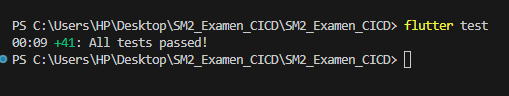
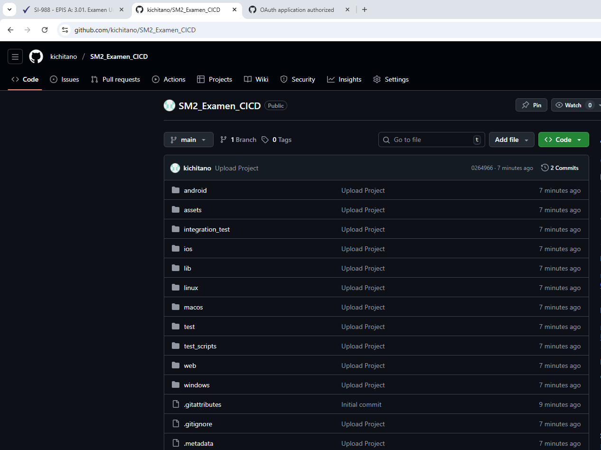
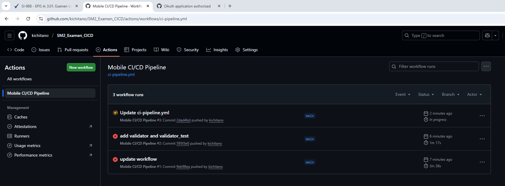
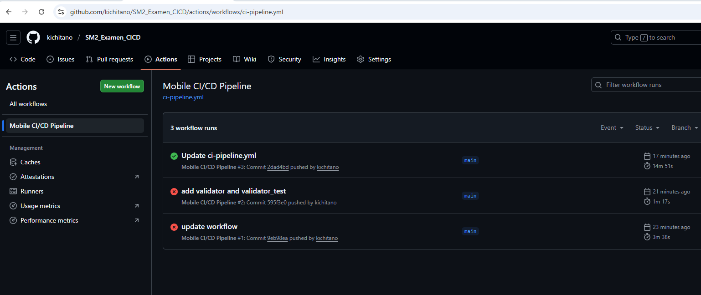
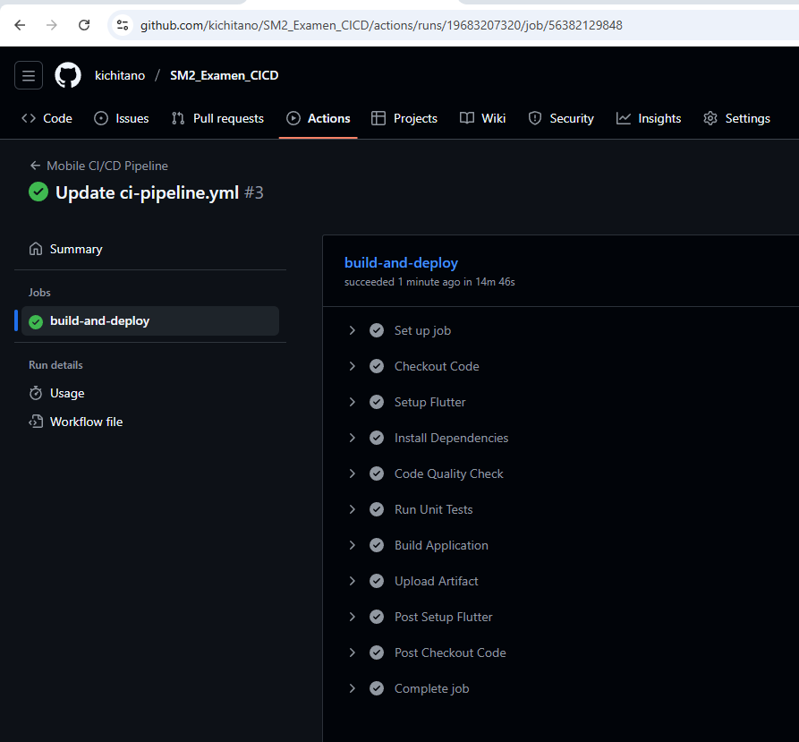
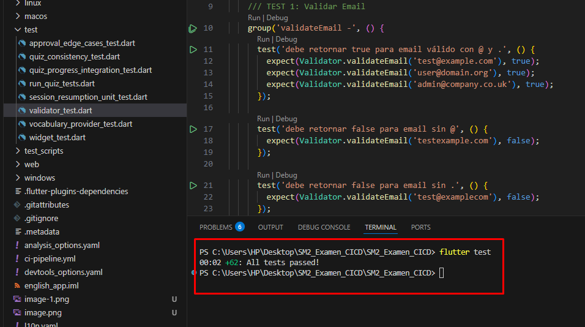
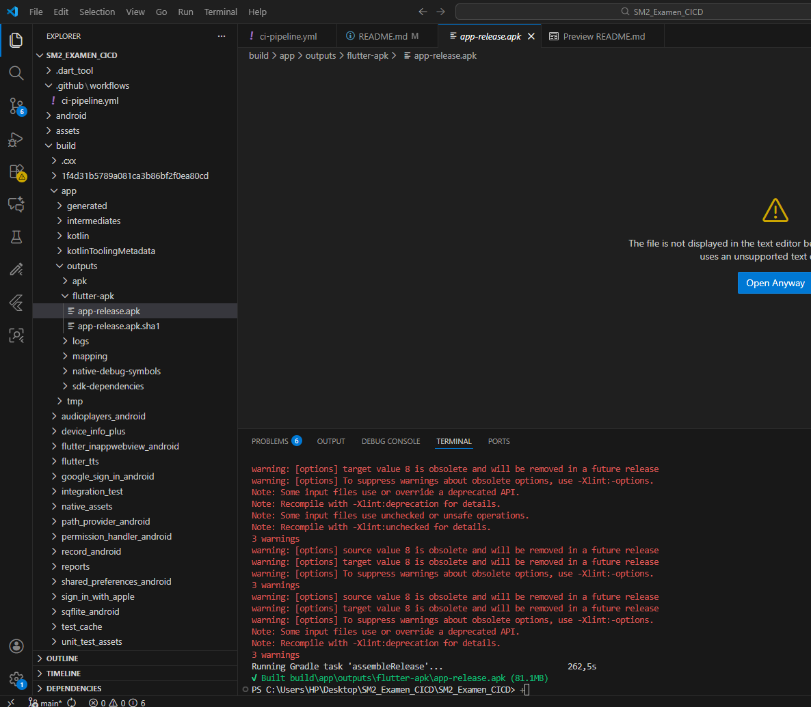
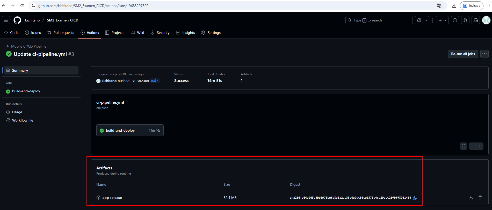

# EXAMEN PRÁCTICO UNIDAD III
## DevOps Móvil: Automatización de Pruebas y Despliegue (CI/CD)

---

## 📋 Datos del Alumno

**Nombre:** Christian Alexander Cespedes Medina

**Tecnología Utilizada:** Flutter

**Curso:** Desarrollo de Aplicaciones Móviles II

**Tema:** Integración y Entrega Continua (CI/CD) con GitHub Actions

---

## 🔗 Enlace al Repositorio

**URL del Repositorio:** https://github.com/kichitano/SM2_Examen_CICD

---

## 🏆 Badge de Estado del Pipeline


---

## ✅ PARTE 1: Lógica de Negocio y Pruebas Unitarias

### 📌 Funciones Implementadas

He implementado 5 funciones de validación en el archivo `lib/utils/validator.dart`:

| # | Función | Descripción | Criterio de Prueba |
|---|---------|-------------|--------------------|
| 1 | `validateEmail()` | Validación de email | Retorna `true` si contiene "@" y ".", de lo contrario `false` |
| 2 | `isPasswordSecure()` | Seguridad de contraseña | Retorna `true` si la longitud es mayor a 6 caracteres |
| 3 | `calculateDiscount()` | Calculadora de descuento | Recibe precio y % descuento, retorna el precio final |
| 4 | `isInValidRange()` | Validar rango numérico | Retorna `true` si el número está entre 1 y 10 (inclusive) |
| 5 | `toUpperCaseText()` | Convertir a mayúsculas | Recibe un texto y lo retorna capitalizado |

### 🧪 Ejecución Local de Tests

**Comando ejecutado:**
```bash
flutter test
```

**📸 EVIDENCIA 1: Captura de Ejecución Local de Tests**



---

## ⚙️ PARTE 2: Configuración del Repositorio

### Pasos Realizados:

1. ✅ Creado repositorio PÚBLICO en GitHub: `SM2_Examen_CICD`
2. ✅ Subido proyecto completo a la rama `main`
3. ✅ Configurado GitHub Actions

**📸 EVIDENCIA 2: Captura del Repositorio en GitHub**



---

## 🔄 PARTE 3: Workflow de GitHub Actions

### 📝 Archivo de Configuración

**Ubicación:** `.github/workflows/ci-pipeline.yml`

### 🔧 Pipeline Configurado (7 Pasos)

El pipeline ejecuta automáticamente los siguientes pasos en cada push o pull request a `main`:

| Paso | Nombre | Comando | Descripción |
|------|--------|---------|-------------|
| 1️⃣ | Checkout Code | `actions/checkout@v3` | Descarga el código del repositorio |
| 2️⃣ | Setup Flutter | `subosito/flutter-action@v2` | Configura Flutter v3.24.0 |
| 3️⃣ | Install Dependencies | `flutter pub get` | Instala dependencias del proyecto |
| 4️⃣ | Code Quality Check | `flutter analyze` | Analiza la calidad del código (linting) |
| 5️⃣ | Run Unit Tests | `flutter test` | Ejecuta las 5 pruebas unitarias |
| 6️⃣ | Build Application | `flutter build apk --release` | Genera el APK de Android |
| 7️⃣ | Upload Artifact | `actions/upload-artifact@v4` | Sube el APK generado |

### 📸 EVIDENCIA 3: Pipeline Completo en GitHub Actions






---

## 🧪 PARTE 4: Evidencia de Pruebas Unitarias en CI

### Validación Automática de los 5 Tests

El paso **"Run Unit Tests"** del pipeline ejecuta automáticamente las 5 pruebas unitarias:

**📸 EVIDENCIA 4: Log de Pruebas Unitarias en GitHub Actions**


**Se agregaron los tests, si se puede ver el punto 1 contra este punto se ve la cantidad de test ejecutados**





---

## 📦 PARTE 5: Construcción del APK

### Build Automático de Release

El pipeline genera automáticamente el APK de Android listo para distribuir.

**Comando ejecutado:**
```bash
flutter build apk --release
```

**Ruta del artefacto generado:**
```
build/app/outputs/flutter-apk/*.apk
```

### 📸 EVIDENCIA 5: Log de Build Application




**Existen algunos problemas por depreciacion no graves ni generan error**


---

## 📥 PARTE 6: Artefacto Descargable (APK)

### Descarga del Instalable

GitHub Actions permite descargar el APK generado automáticamente.

**📸 EVIDENCIA 6: Sección de Artifacts en GitHub Actions**


